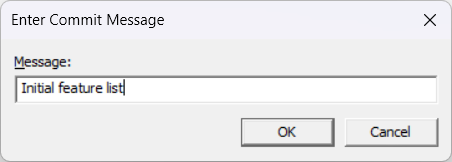

# Win32 Text Editor with Version History


A native Windows desktop text editor built using C++ and the Win32 API, featuring an integrated, session-based version history management system inspired by Git concepts.

This editor provides standard text editing capabilities within a tabbed interface and enhances the workflow with a powerful history tracking feature, allowing users to navigate, visualize, and revert to previous states of their document within the current editing session.

## Key Features

*   **Tabbed Document Interface:** Open and edit multiple files simultaneously in separate tabs.
*   **Rich Text Editing:** Utilizes the Windows Rich Edit control for basic text editing features.
*   **Standard File Operations:** New, Open, Save, Save As.
*   **Integrated Version History:**
    *   **Manual Commits:** Manually create named versions (commits) of the document state.
    *   **History Tree Visualization:** View the entire version history as a tree, showing branches and commit details (timestamp, message, simple diff stats).
    *   **Branching Navigation:** Navigate back and forth through the history, including divergent branches (similar to `git checkout` on different commits/branches).
    *   **State Restoration:** Switch the editor content to any selected version from the history tree.
    *   **Commit Deletion:** Prune unwanted history branches (excluding the root and the currently active state).
*   **Unsaved Changes Indication:** Tabs and window title indicate modified files.

<!-- ## Screenshots

[Screenshot of the main editor window with multiple tabs]
[Screenshot of the History Tree dialog showing branches]
[Screenshot of the Commit Message dialog] -->
*(screenshots)*




## Technology Stack

*   **Language:** C++ (using modern features like STL containers, smart pointers)
*   **Platform:** Windows (Desktop)
*   **API:** Win32 API, Windows Common Controls (Tab Control, Rich Edit, TreeView, Dialogs)
*   **Build System:** Visual Studio (MSVC)

## Getting Started

### Prerequisites

*   Windows Operating System (7/8/10/11)
*   Visual Studio (2019 or later recommended) with C++ Desktop Development workload installed.
*   Windows SDK (usually installed with Visual Studio).

### Building

1.  **Clone the repository:**
    ```bash
    git clone <repository-url>
    cd <repository-directory>
    ```
2.  **Open the Solution:** Double-click the `TextEditor.sln` file to open it in Visual Studio.
3.  **Select Configuration:** Choose the desired build configuration (e.g., `Debug` or `Release`) and platform (e.g., `x64` or `Win32`).
4.  **Build:** Build the solution (Build Menu -> Build Solution or press `Ctrl+Shift+B`).
5.  **Run:** The executable will be located in the output directory (e.g., `x64/Debug/TextEditor.exe`).

## Usage

1.  Launch the `TextEditor.exe` application.
2.  Use the `File` menu or `Ctrl+N`/`Ctrl+O` to create or open text files.
3.  Edit text within the tabs. The editor uses the Rich Edit control.
4.  Save files using `Ctrl+S` (Save) or `Ctrl+Shift+S` (Save As).

### Version History Interaction

*   **Manual Commit (`Alt+S` or Edit Menu):** Create a specific version point. You will be prompted to enter an optional commit message. Useful for marking important milestones.
*   **View History (`Alt+H` or Edit Menu):** Opens the "Version History" dialog.
    *   The tree displays all recorded versions for the current document session.
    *   The currently active state in the editor is marked as "(Current)".
    *   Select any version in the tree.
    *   Click **"Checkout"** to load the selected version's content into the editor. This changes the current state and potentially creates a new branch if you start editing from an older state.
    *   Select a version (that is *not* the root and *not* the current state) and click **"Delete"** to remove it and its descendants from the history tree.
*   **Navigate History (`Ctrl+Alt+Left` / `Ctrl+Alt+Right`):**
    *   `Ctrl+Alt+Left`: Moves to the parent version in the history (like Undo, but following the tree).
    *   `Ctrl+Alt+Right`: Moves to a child version. If the current version has multiple children (branches), a dialog appears allowing you to choose which branch to follow.

**Note:** The version history is currently session-based and is **not** saved to disk with the file itself. Closing a tab or the application discards the history for that document.


This system provides a lightweight, integrated way to track changes without relying on external tools like Git for the *local editing session*.

## Contributing

Contributions are welcome! Please follow standard GitHub practices:

1.  Fork the repository.
2.  Create a new branch (`git checkout -b feature/YourFeature`).
3.  Commit your changes (`git commit -m 'Add some feature'`).
4.  Push to the branch (`git push origin feature/YourFeature`).
5.  Open a Pull Request.

Please ensure your code adheres to the existing style and includes comments where necessary.


## Acknowledgements

*   Built using the powerful Win32 API.
*   Inspired by version control systems like Git.